# CSE 151A Group Project | Image Colorization
## Introduction
The goal of our project is image colorization, what we'll define as the process of generating a full color image from black-and-white information. To us, this idea is so compelling becuase of its generative nature. We wanted to do something more complex than classifying data or images. It would also be easy to create more data for our model to train on if we didn’t have enough to start with, since it is not too difficult to convert colored images into black-and-white images. We thought the project was cool because it lies at the intersection of technology and art. Some of the applications of such a project could potentially be color restoration of historical images, restoration of black and white films if you apply the model frame by frame. It could potentially be used as a tool for people with color-blindness, transforming the black-and-white images into images with more contrasting colors that makes it easier for people to process. It could also just be used as a tool for digital artists to play around with.

## Figures

Figures 1.1-1.4 are for data exploration/visualization and help shed light on some later results.

**Figure 1.1:** Selected images from the dataset and their individual red, blue, and green channels
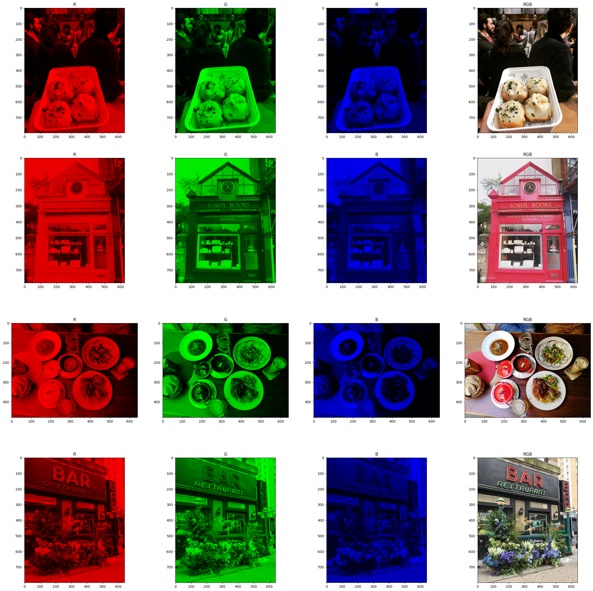

**Figure 1.2:** Selected images from the dataset with their L, L and a, and L and b channels.


**Figure 1.3:** A frequency plot of pixel brightness for each RGB channel from the entire dataset
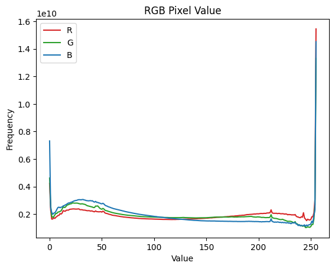

**Figure 1.4:** A frequency plot of pixel brightness for each Lab channel from the entire dataset
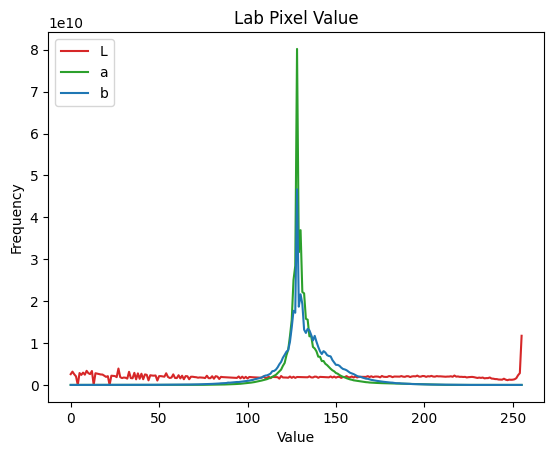

**Figure 1.5:** A frequency plot of image heights from the entire dataset
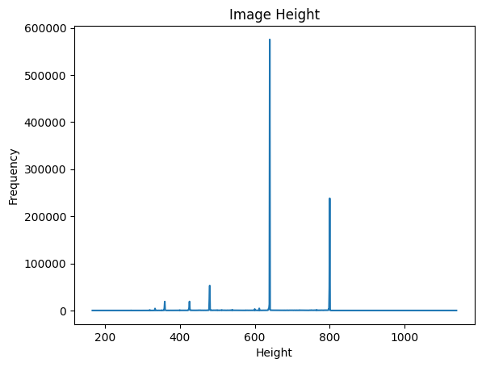

**Figure 1.6:** A frequency plot of image widths from the entire dataset
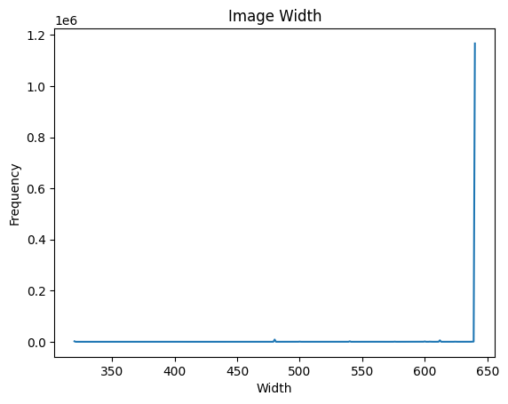

## Method

### Data Exploration
Our data exploration began with running [data_expl_preprocess.py](data_exploration/data_expl_preprocess.py). This script extracts the dataset using ZipFile, then, using a multiprocessing pool, loops through all images in the dataset and calls `process_image(image_file)` with a callback to `update_totals(result)`. The `process_image(image_file)` function loads one image into memory, converts it to RGB and Lab colorspace, and calculates the freqeuency of each pixel brightness for each channel and both colorspaces. Then, it returns this frequency table along with the dimensions of the image. The same process is also descibed in the notebook [data_expl_preprocess.ipynb](data_exploration/data_expl_preprocess.ipynb), but without multithreading.

```python
def process_image(image_file):
    im_BGR = cv2.imread(str(image_file))
    if im_BGR is None:
        print("Couldn't read image from", image_file)
        return None, None

    im_RGB = cv2.cvtColor(im_BGR, cv2.COLOR_BGR2RGB)
    im_Lab = cv2.cvtColor(im_BGR, cv2.COLOR_BGR2Lab)

    im = np.append(im_RGB, im_Lab, axis=2)
    height, width, num_channels = im.shape

    sizes = np.array([height, width])

    counts_per_channel = np.zeros((num_channels, 256), dtype=np.int64)
    for channel in range(num_channels):
        channel_values = im[:, :, channel]
        counts = np.bincount(channel_values.flatten(), minlength=256)
        counts_per_channel[channel, :] = counts

    return counts_per_channel, sizes
```

`update_totals(result)` adds the frequencies to a global running array of sums and concatenates the height and width of the image to another array.

```python
def update_totals(result):
    global counts_per_channel_tot, sizes, idx, failed_reads
    counts_per_channel, size = result
    idx += 1
    if counts_per_channel is not None:
        counts_per_channel_tot += counts_per_channel
        sizes[idx, :] = size
        if idx % 10000 == 0:
            gc.collect()
            print('Processed Image:', idx, flush=True)
    else:
        failed_reads += 1
```

In the end, the script produces the csv files [RGB_frequencies.csv](data_exploration/RGB_frequencies.csv), [Lab_frequencies.csv](data_exploration/Lab_frequencies.csv), and [image_sizes.csv](data_exploration/image_sizes.csv).

These csv files were then loaded in the [data_exploration.ipynb notebook](data_exploration/data_exploration.ipynb), in which we use the function `calculate_stats(frequencies)` to descibe the two frequency datasets.

```python
def calculate_stats(frequencies):
    # mean
    values = np.arange(len(frequencies), dtype=np.int64)
    sum_vals = np.sum(values * frequencies)
    num_observ = np.sum(frequencies)
    mean = sum_vals / num_observ

    # std
    sq_diffs = (values - mean) ** 2
    weighted_sq_diff_sum = np.sum(sq_diffs * frequencies)
    std = math.sqrt(weighted_sq_diff_sum / num_observ)

    # lower quartile, median, upper quartile
    cum_freq = np.cumsum(frequencies)

    low_quartile = np.searchsorted(cum_freq, num_observ * 0.25)
    median = np.searchsorted(cum_freq, num_observ * 0.5)
    up_quartile = np.searchsorted(cum_freq, num_observ * 0.75)

    # min and max
    nonzero_freq = np.nonzero(frequencies)[0]
    min = nonzero_freq[0]
    max = nonzero_freq[-1]

    return [num_observ, mean, std, min, low_quartile, median, up_quartile, max]
```

The results are as follows:

| channel | count        | mean       | std       | min | lower quartile | median | upper quartile | max |
|---------|--------------|------------|-----------|-----|----------------|--------|----------------|-----|
| R       | 5.000036e+11 | 128.549689 | 78.269088 | 0   | 56             | 129    | 199            | 255 |
| G       | 5.000036e+11 | 118.101712 | 76.194890 | 0   | 48             | 113    | 184            | 255 |
| B       | 5.000036e+11 | 111.279365 | 76.903435 | 0   | 43             | 98     | 176            | 255 |

| channel | count        | mean       | std       | min | lower quartile | median | upper quartile | max |
|---------|--------------|------------|-----------|-----|----------------|--------|----------------|-----|
| L       | 5.000036e+11 | 126.073445 | 76.030077 | 0   | 58             | 127    | 192            | 255 |
| a       | 5.000036e+11 | 132.215300 | 12.766182 | 42  | 127            | 129    | 135            | 226 |
| b       | 5.000036e+11 | 133.733791 | 17.359528 | 20  | 126            | 131    | 142            | 223 |


Then, we plot these frequencies as seen in figures 1.3 and 1.4. The plotting code for the RGB frequencies is show below. The Lab code is similar.

```python
RGB_graph_colors = ['tab:red', 'tab:green', 'tab:blue']
values = range(0, 256)

for idx, channel in enumerate(RGB_channels):
    plt.plot(values, RGB_frequencies[idx], color=RGB_graph_colors[idx])
    plt.title('RGB Pixel Value')
    plt.xlabel('Value')
    plt.ylabel('Frequency')

plt.legend(RGB_channels, loc='upper left')
plt.show()
```

Next, we use pandas to describe the size dataset:

|       | height       | width        |
|-------|--------------|--------------|
| count | 1.211628e+06 | 1.211628e+06 |
|  mean | 6.478348e+02 | 6.358189e+02 |
|   std | 1.181346e+02 | 2.680423e+01 |
|   min | 1.670000e+02 | 3.200000e+02 |
|   25% | 6.400000e+02 | 6.400000e+02 |
|   50% | 6.400000e+02 | 6.400000e+02 |
|   75% | 7.750000e+02 | 6.400000e+02 |
|   max | 1.138000e+03 | 6.400000e+02 |

We also calculate the frequencies of the heights and widths using `np.bincount()` and plot them as seen in figures 1.5 and 1.6.

As a last step, we visualize 4 selected images, along with their distinct channels and channel combinations. We plot the red, blue, and green channels along with the lightness channel, lightness and a combination, and lightness and b combination. Below is the plotting function we use:

```python
def plot_images(images, color_space, channels, titles, figsize=(30, 30)):
    plt.figure(figsize=figsize)
    for i in range(0, len(images) * 4, 4):
        idx = i // 4
        for j, (channel, title) in enumerate(zip(channels, titles)):
            plt.subplot(len(images), 4, i + j + 1)
            img = np.zeros_like(images[idx])
            if color_space == 'RGB':
                if channel == 'RGB':
                    img = images[idx]
                else:
                    img[:, :, j] = images[idx][:, :, j]
            elif color_space == 'Lab':
                if channel == 'Lab':
                    img = cv2.cvtColor(images[idx], cv2.COLOR_Lab2RGB)
                elif channel == 'L':
                    img = np.stack([images[idx][:, :, 0]] * 3, axis=-1)
                elif channel == 'a':
                    img[:, :, (0, 1)] = images[idx][:, :, (0, 1)]
                    img = cv2.cvtColor(img, cv2.COLOR_Lab2RGB)
                elif channel == 'b':
                    img[:, :, (0, 2)] = images[idx][:, :, (0, 2)]
                    img = cv2.cvtColor(img, cv2.COLOR_Lab2RGB)
            plt.title(title)
            plt.imshow(img.astype('uint8'))
```

### Preprocessing
We performed two preprocessing steps, resizing and grayscale image removal, along with on the fly RGB to Lab colorspace conversion for some models.

#### Resizing
To resize the images, we created a script [resize.py](resize.py) which loops through all images in the dataset. If an image is too small to be cropped (has a dimension smaller than our target size, 512px), it is removed . Otherwise `center_crop(image, crop_size=(512, 512))`, as defined below, is called on the image. The result is written to the disk.

```python
def center_crop(image, crop_size=(512, 512)):
    h, w, _ = image.shape
    ch, cw = crop_size
    start_x = w // 2 - cw // 2
    start_y = h // 2 - ch // 2
    return image[start_y:start_y+ch, start_x:start_x+cw]
```

#### Grayscale Image Removal
To remove grayscale images from the dataset, we created a script [grayscale.py](grayscale.py) which loops though the entire dataset using a multiprocessing pool, and uses the following function `is_grayscale_fast(image_path)` to find grayscale images and output a list of their paths to a text file.

```python
def is_grayscale_fast(image_path):
    try:
        with Image.open(image_path) as img:
            if img.mode == 'L':
                return image_path
            img_array = np.array(img)
            if img_array.ndim == 2 or img_array.shape[2] == 1:
                return image_path
            # Check a sample of pixels
            sample_size = 1000
            h, w = img_array.shape[:2]
            samples = img_array[np.random.randint(0, h, sample_size),
                                np.random.randint(0, w, sample_size)]

            if np.max(np.std(samples, axis=1)) < 0.1:
                return image_path
    except Exception as e:
        print(f"Error processing {image_path}: {str(e)}")
    return None
```

Then, after reviewing the list, we used the bash command `xargs -a {output_file} rm` to remove the grayscale images. Note: `{output_file}` is the path to the outputed list of grayscale images.

#### On the Fly RGB to LAB
To convert images from the RGB colorspace to Lab colorspace, we developed a function `rgb_to_lab(rgb_image: torch.Tensor)` that leverges PyTorch's optimized tensor operations. The algorithm itself was adapted from [skimage.color.rgb2lab()](https://scikit-image.org/docs/stable/api/skimage.color.html#skimage.color.rgb2lab).

```python
def rgb_to_lab(rgb_image: torch.Tensor) -> tuple[torch.Tensor, torch.Tensor]:
    with torch.no_grad():
        RGB_TO_XYZ = torch.tensor(
            [
                [0.412453, 0.357580, 0.180423],
                [0.212671, 0.715160, 0.072169],
                [0.019334, 0.119193, 0.950227],
            ],
            dtype=torch.float32,
            device=rgb_image.device,
        )
        XYZ_REF = torch.tensor([0.95047, 1.0, 1.08883], dtype=torch.float32, device=rgb_image.device)
        
        # Convert RGB to linear RGB
        if rgb_image.max() > 1.0:
            rgb_image = rgb_image / 255.0

        mask = rgb_image > 0.04045
        rgb_linear = torch.where(mask, torch.pow(((rgb_image + 0.055) / 1.055), 2.4), rgb_image / 12.92)
        
        # Convert linear RGB to XYZ
        xyz = torch.matmul(rgb_linear, RGB_TO_XYZ.t())
        
        # Normalize XYZ values
        xyz_scaled = xyz / XYZ_REF
        
        # XYZ to LAB conversion
        epsilon = 0.008856
        kappa = 903.3
        
        f = torch.where(xyz > epsilon, xyz_scaled.pow(1/3), (kappa * xyz_scaled + 16) / 116)

        x, y, z = f[..., 0], f[..., 1], f[..., 2]
        l = (116 * y - 16).unsqueeze(0)
        a = (500 * (x - y)).unsqueeze(0)
        b = (200 * (y - z)).unsqueeze(0)
        ab = torch.cat([a, b], dim=0)
        
        # Normalize to [-1, 1]
        l = (l / 50.0) - 1.0
        ab = ab / 110.0
        
        return l, ab
```

### Model 1: Convolutional Neural Network
Our first model is a standard convolutional neural network, commonly refered to as a CNN or ConvNet, which takes as input a 512x512 tensor, a grayscale image, and outputs a 512x512x3 tensor, the red, green, and blue channels of a colorized image.

A walkthrough of the model and training can be found here: [train_covnet.ipynb](train_convnet.ipynb).\
The model definition and training script can be found here: [train_convnet.py](training_scripts/train_convnet.py).

The encoder was defined as follows:
```python
self.encoder = nn.Sequential(
            nn.Conv2d(1, 32, kernel_size=3, padding=1),
            nn.SiLU(inplace=True),
            nn.Conv2d(32, 64, kernel_size=3, padding=1),
            nn.SiLU(inplace=True),
            nn.MaxPool2d(kernel_size=2, stride=2),

            nn.Conv2d(64, 128, kernel_size=3, padding=1),
            nn.SiLU(inplace=True),
            nn.Conv2d(128, 256, kernel_size=3, padding=1),
            nn.SiLU(inplace=True),
            nn.MaxPool2d(kernel_size=2, stride=2),

            nn.Conv2d(256, 512, kernel_size=3, padding=1),
            nn.SiLU(inplace=True),
            nn.Conv2d(512, 1024, kernel_size=3, padding=1),
            nn.SiLU(inplace=True),
            nn.MaxPool2d(kernel_size=2, stride=2),
        )
```

And the decoder similarly:
```python
self.decoder = nn.Sequential(
            nn.ConvTranspose2d(1024, 512, kernel_size=2, stride=2),
            nn.SiLU(inplace=True),
            nn.Conv2d(512, 256, kernel_size=3, padding=1),
            nn.SiLU(inplace=True),

            nn.ConvTranspose2d(256, 128, kernel_size=2, stride=2),
            nn.SiLU(inplace=True),
            nn.Conv2d(128, 64, kernel_size=3, padding=1),
            nn.SiLU(inplace=True),

            nn.ConvTranspose2d(64, 32, kernel_size=2, stride=2),
            nn.SiLU(inplace=True),
            nn.Conv2d(32, 16, kernel_size=3, padding=1),
            nn.SiLU(inplace=True),

            nn.Conv2d(16, 3, kernel_size=3, padding=1),
        )
```
- **Paramaters:** 9,783,459
- **Batch Size:** 10
- **Loss Function:** Huber Loss
- **Optimizer:** Adam
- **Validation Frequency:** 1000 steps
- **Weight Decay:** 10e-5
- **Learning Rate:** linear warmup from 7.0e-5 to 7.0e-4 over 1000 steps followed by cosine decay. See below:

```python
def lr_lambda(current_step: int):
    if current_step < settings.warmup_steps:
        return float(current_step) / float(max(1, settings.warmup_steps))
    cosine_decay = 0.5 * (1 + np.cos(np.pi * (current_step - settings.warmup_steps) / (settings.num_steps - settings.warmup_steps)))
    return (settings.min_lr + (settings.learning_rate - settings.min_lr) * cosine_decay) / settings.learning_rate
```
where
```python
learning_rate: float = 0.0007
min_lr: float = learning_rate / 10
warmup_steps: int = 1000
```

### Model 2: U-Net
Our second model is U-Net that takes in a 512x512 tensor, the lightness (L) channel of a Lab colorspace formatted image, and outputs a 512x512x2 tensor, the a and b channels of the colored image, again in Lab colorspace.


[Image Source](https://towardsdatascience.com/u-net-explained-understanding-its-image-segmentation-architecture-56e4842e313a)

A walkthrough of the model and training can be found here: [train_unet.ipynb](train_convnet.ipynb).\
A standalone model definition can be found here: [unet.py](training_scripts/unet.py).\
The training script can be found here: [train_unet.py](training_scripts/train_unet.py).

- **Parameters:** 4,409,858
- **Batch Size:** 64
- **Loss Function:** L1 Loss
- **Optimizer:** AdamW
- **Validation Frequency:** 1000 steps
- **Weight Decay:** 10e-5
- **Early Stopping Patience:** 5 (early stop never triggered)
- **Learning Rate:** linear warmup from 7.0e-5 to 7.0e-4, or 3.5e-4 for fine tuning, over 1000 steps followed by cosine decay. Same as ConvNet model

```python
class UnetBlock(nn.Module):
    def __init__(
        self,
        nf,
        ni,
        submodule=None,
        input_c=None,
        dropout=False,
        innermost=False,
        outermost=False,
        use_attention=True,
    ):
        super().__init__()
        self.outermost = outermost
        self.use_attention = use_attention
        if input_c is None:
            input_c = nf
        downconv = nn.Conv2d(
            input_c, ni, kernel_size=4, stride=2, padding=1, bias=False
        )
        downrelu = nn.LeakyReLU(0.2, True)
        downnorm = nn.BatchNorm2d(ni)
        uprelu = nn.ReLU(True)
        upnorm = nn.BatchNorm2d(nf)

        if outermost:
            upconv = nn.ConvTranspose2d(ni * 2, nf, kernel_size=4, stride=2, padding=1)
            down = [downconv]
            up = [uprelu, upconv, nn.Tanh()]
            model = down + [submodule] + up
        elif innermost:
            upconv = nn.ConvTranspose2d(
                ni, nf, kernel_size=4, stride=2, padding=1, bias=False
            )
            down = [downrelu, downconv]
            up = [uprelu, upconv, upnorm]
            model = down + up
        else:
            upconv = nn.ConvTranspose2d(
                ni * 2, nf, kernel_size=4, stride=2, padding=1, bias=False
            )
            down = [downrelu, downconv, downnorm]
            up = [uprelu, upconv, upnorm]
            if dropout:
                up += [nn.Dropout(0.5)]
            model = down + [submodule] + up

        self.model = nn.Sequential(*model)
        # Apply attention module if needed, except for the outermost layer and when the number of filters is too high
        self.use_attention_this_layer = not outermost and nf <= 512 and use_attention
        if self.use_attention_this_layer:
            self.attention = CrissCrossAttention(nf)

    def forward(self, x):
        if self.outermost:
            return self.model(x)
        else:
            output = self.model(x)
            if self.use_attention_this_layer:
                output = self.attention(output)
            return torch.cat([x, output], 1)
```

### Model 3: U-Net with Criss-Cross Attention

Our third model is a U-Net with Criss-Cross Attention that takes in a 512x512 tensor, the lightness (L) channel of a Lab colorspace formatted image, and outputs a 512x512x2 tensor, the a and b channels of the colored image, again in Lab colorspace.

A walkthrough of the model and training can be found here: [train_unet.ipynb](train_convnet.ipynb).\
A standalone model definition can be found here: [unet.py](training_scripts/unet.py).\
The training script can be found here: [train_unet.py](training_scripts/train_unet.py).\
(same files as previous model, boolean argument to enable attention)

Criss Cross attention is a modification of the standard transformer attention that only attends to the pixels in the same row and column as the pixel in question, which drastically reduces the memory requirements. After two iterations of attention the model has at least indirectly attended to every pixel.

- **Parameters:** 54,980,593
- **Batch Size:** 64
- **Loss Function:** L1 Loss
- **Optimizer:** AdamW
- **Validation Frequency:** 1000 steps
- **Weight Decay:** 10e-5
- **Early Stopping Patience:** 5 (early stop never triggered)
- **Learning Rate:** Linear warmup from 7.0e-5 to 7.0e-4 over 1000 steps followed by cosine decay. Same as ConvNet model. Maximum learning rate halved each epoch

```python
class CrissCrossAttention(nn.Module):
    def __init__(self, in_dim):
        super().__init__()
        self.channel_in = in_dim
        self.channel_out = in_dim // 8
        # Combined QKV projection
        self.qkv_conv = nn.Conv2d(in_dim, 3 * self.channel_out, 1)

        self.gamma = nn.Parameter(torch.zeros(1))
        self.out_conv = nn.Conv2d(in_dim // 8, in_dim, 1)

    def forward(self, x):
        B, C, H, W = x.size()
        
        # Combined QKV projection
        qkv = self.qkv_conv(x)
        query, key, value = qkv.chunk(3, dim=1)
        
        # Horizontal attention
        query_h = query.permute(0, 3, 1, 2).contiguous().view(B*W, self.channel_out, H)
        key_h = key.permute(0, 3, 1, 2).contiguous().view(B*W, self.channel_out, H)
        value_h = value.permute(0, 3, 1, 2).contiguous().view(B*W, self.channel_out, H)
        
        energy_h = torch.bmm(query_h, key_h.transpose(1, 2))
        attn_h = F.softmax(energy_h, dim=-1)
        out_h = torch.bmm(attn_h, value_h)
        
        # Vertical attention
        query_v = query.permute(0, 2, 1, 3).contiguous().view(B*H, self.channel_out, W)
        key_v = key.permute(0, 2, 1, 3).contiguous().view(B*H, self.channel_out, W)
        value_v = value.permute(0, 2, 1, 3).contiguous().view(B*H, self.channel_out, W)
        
        energy_v = torch.bmm(query_v, key_v.transpose(1, 2))
        attn_v = F.softmax(energy_v, dim=-1)
        out_v = torch.bmm(attn_v, value_v)
        
        # Reshape and combine
        out_h = out_h.view(B, W, self.channel_out, H).permute(0, 2, 3, 1)
        out_v = out_v.view(B, H, self.channel_out, W).permute(0, 2, 1, 3)
        
        out = out_h + out_v
        out = self.gamma * out
        
        # Project back to the original channel dimension
        out = self.out_conv(out)
        
        return out + x
```

### Model 4: U-Net GAN with Criss-Cross Attention

Our third model is a U-Net GAN with Criss-Cross Attention that takes in a 512x512 tensor, the lightness (L) channel of a Lab colorspace formatted image, and outputs a 512x512x2 tensor, the a and b channels of the colored image, again in Lab colorspace.

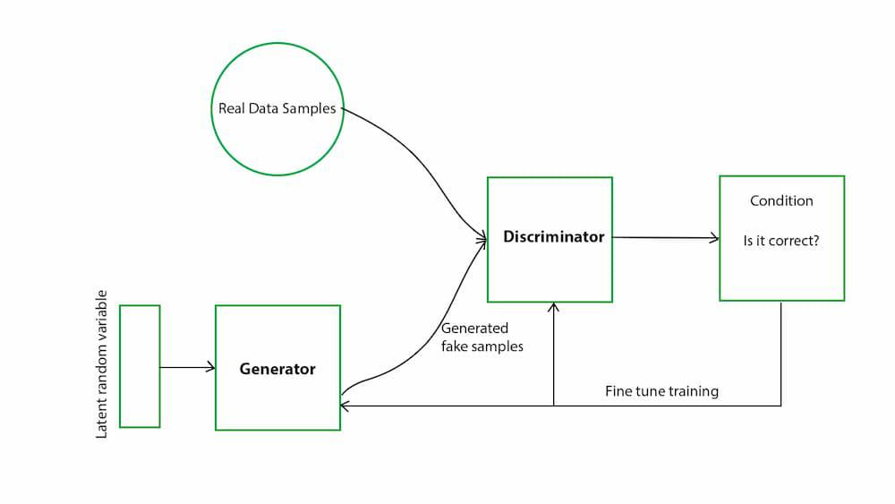
[Image Source](https://www.geeksforgeeks.org/generative-adversarial-network-gan/)

A walkthrough of the model and training can be found here: [train_unet_gan.ipynb](train_unet_gan.ipynb).\
GAN loss is programmed in the following: [ganloss.py](training_scripts/ganloss.py) \
Discriminator is programmed in the following: [discriminator.py](training_scripts/discriminator.py) \
Model definition is programmed in the following: [model.py](training_scripts/model.py) \
Training is programmed in the following: [train_unet_gan.py](training_scripts/train_unet_gan.py)

- **Generator Parameters:** 54,980,593
- **Discriminator Paramaters:** 20,949654

The discriminator analyzes the input images at multiple scales and predicts whether the given image is 'fake' or 'real'.

```python
class MultiScaleDiscriminator(nn.Module):
    def __init__(self, input_c, num_filters=64, n_layers=5, num_D=3):
        super().__init__()
        self.num_D = num_D
        self.n_layers = n_layers

        for i in range(num_D):
            netD = Discriminator(input_c, num_filters, n_layers)
            setattr(self, f"layer_{i}", netD)

        self.downsample = nn.AvgPool2d(
            3, stride=2, padding=[1, 1], count_include_pad=False
        )

    def singleD_forward(self, model, input):
        result = [input]
        for i in range(len(model)):
            result.append(model[i](result[-1]))
        return result[1:]

    def forward(self, input):
        result = []
        input_downsampled = input
        for i in range(self.num_D):
            model = getattr(self, f"layer_{i}")
            result.append(self.singleD_forward(model.model, input_downsampled))
            if i != (self.num_D - 1):
                input_downsampled = self.downsample(input_downsampled)
        return result
```

The gan loss takes the logits of discrimator and produces a loss that the generator can use improve its image outputs.
```python
class GANLoss(nn.Module):
    def __init__(self, gan_mode="vanilla", real_label=0.9, fake_label=0.1):
        super().__init__()
        self.register_buffer("real_label", torch.tensor(real_label))
        self.register_buffer("fake_label", torch.tensor(fake_label))
        self.gan_mode = gan_mode
        if gan_mode == "vanilla":
            self.loss = nn.BCEWithLogitsLoss()
        elif gan_mode == "lsgan":
            self.loss = nn.MSELoss()
        else:
            raise NotImplementedError(f"gan_mode {gan_mode} not implemented")

    def get_labels(self, preds, target_is_real):
        if target_is_real:
            labels = self.real_label
        else:
            labels = self.fake_label
        return labels.expand_as(preds)

    def __call__(self, prediction, target_is_real):
        target_tensor = self.get_labels(prediction, target_is_real)
        loss = self.loss(prediction, target_tensor)
        return loss
```

The GAN model puts the generator (U-Net) and discriminator into a zero sum game. The generator attempts to generate images that fool the discriminator, and the discriminator attempts to classify images from the generator as 'fake'. The goal of this game is a more effective generator model that produces higher quality colorizations, however the gan architechure will not ever converge to a final solution and can sometimes suffer mode collapse. Because of this each n steps are logged and images of its output are saved so that it can be later decided which iteration of the generator model to use.

## Results

### Model 1: Convolutional Neural Network
**Figure 3.1.1:** ConvNet Validation Set Results


**Legend:**\
**Top image:** grayscale input\
**Middle image:** model output\
**Bottom image:** expected output

**Figure 3.1.2:** ConvNet Training Loss
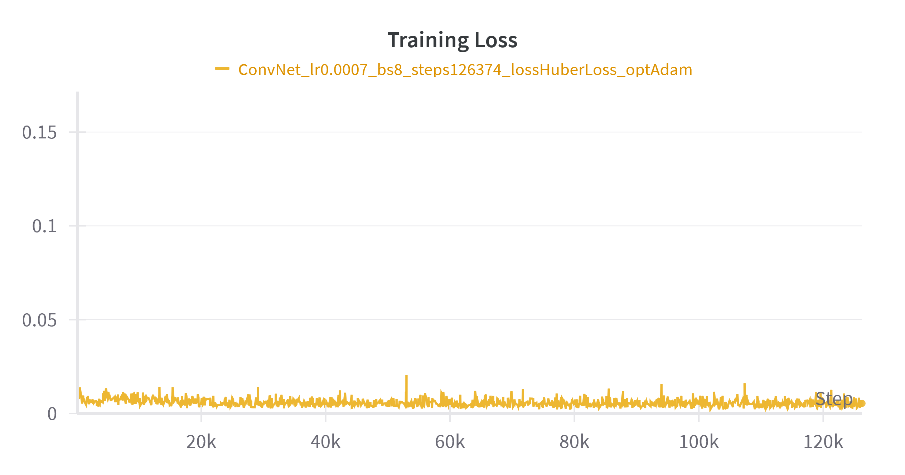

**Figure 3.1.3:** ConvNet Validation Loss
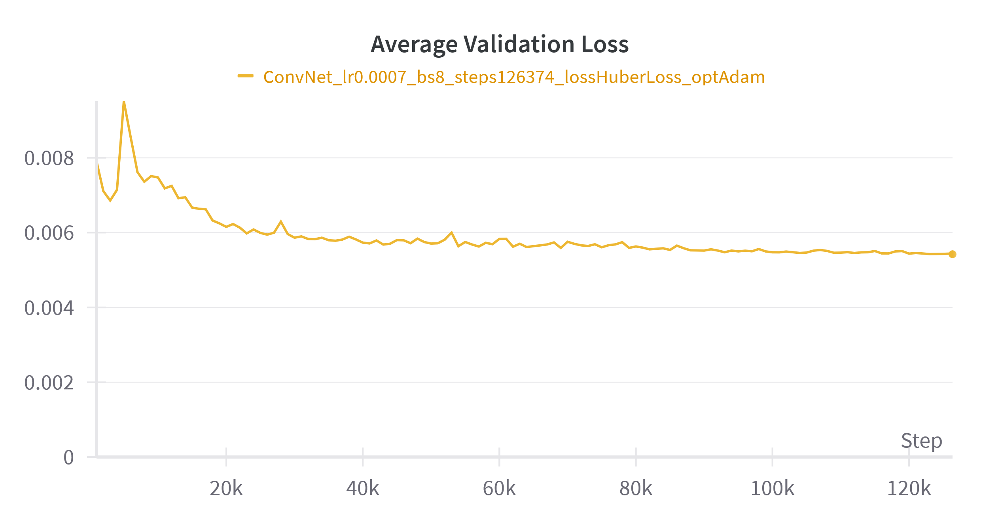

### Model 2: U-Net
**Figure 3.2.1:** U-Net Validation Set Results


**Legend:**\
**Top image:** grayscale input\
**Middle image:** model output\
**Bottom image:** expected output

**Figure 3.2.2:** ConvNet Training Loss
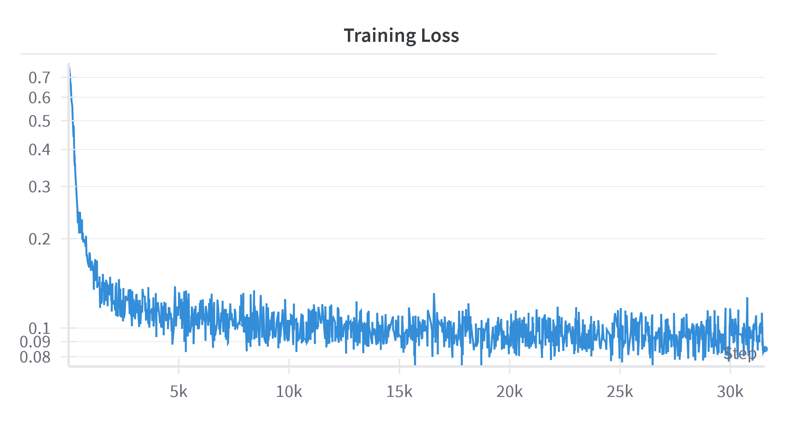

**Figure 3.2.3:** ConvNet Validation Loss
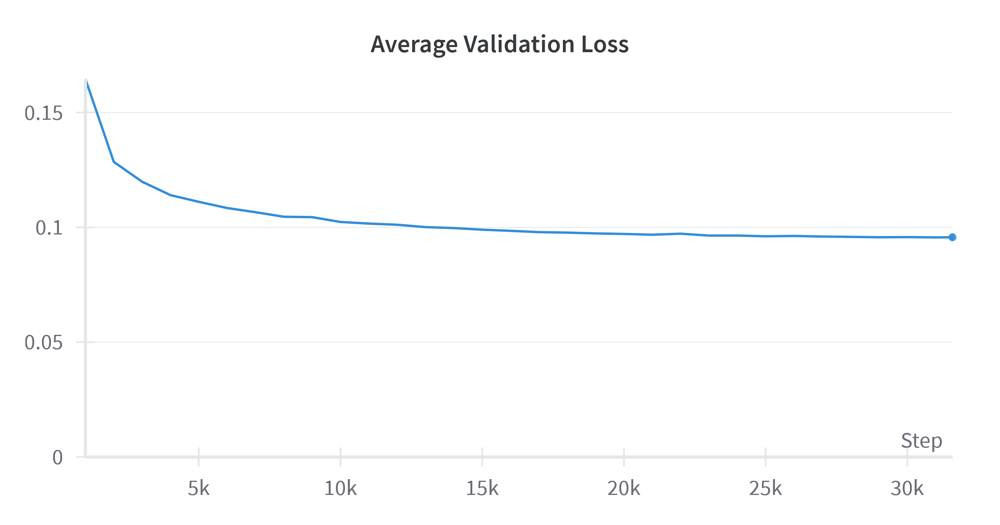

### Model 3: U-Net with Criss-Cross Attention

**Figure 3.3.1:** U-Net Attention Epoch 1 Validation Set Results


**Figure 3.3.2:** U-Net Attention Epoch 2 Validation Set Results


**Figure 3.3.3:** U-Net Attention Epoch 3 Validation Set Results


**Figure 3.3.4:** U-Net Attention Epoch 4 Validation Set Results


**Legend:**\
**Top image:** grayscale input\
**Middle image:** model output\
**Bottom image:** expected output

**Figure 3.3.5:** U-Net Attention Epoch 1 Training Loss
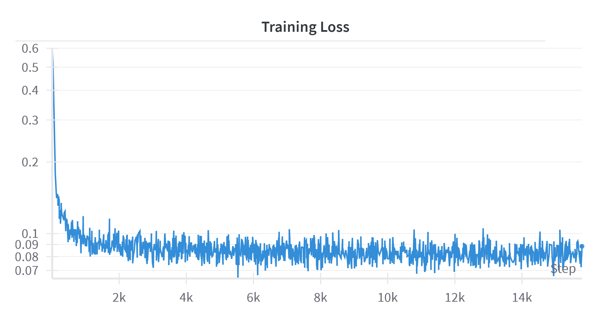

**Figure 3.3.6:** U-Net Attention Epoch 2 Training Loss
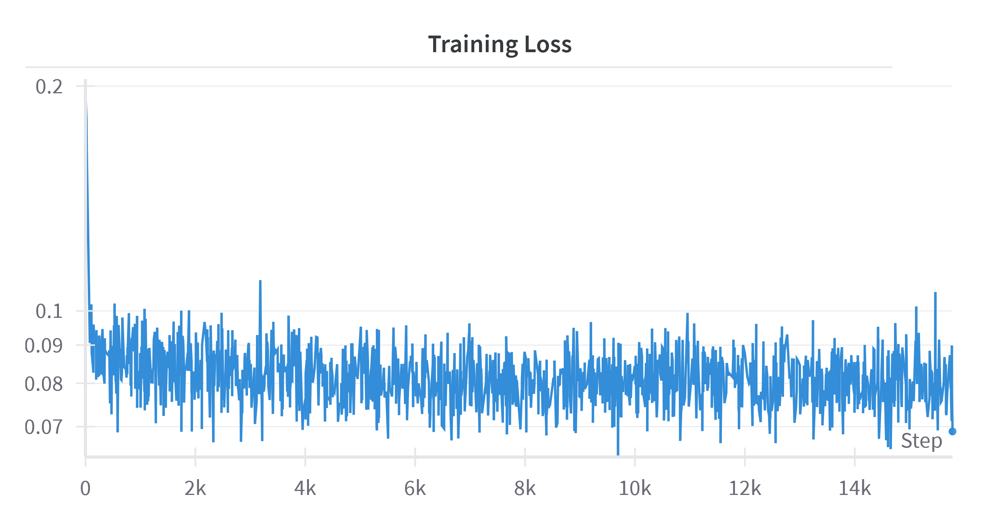

**Figure 3.3.7:** U-Net Attention Epoch 3 Training Loss
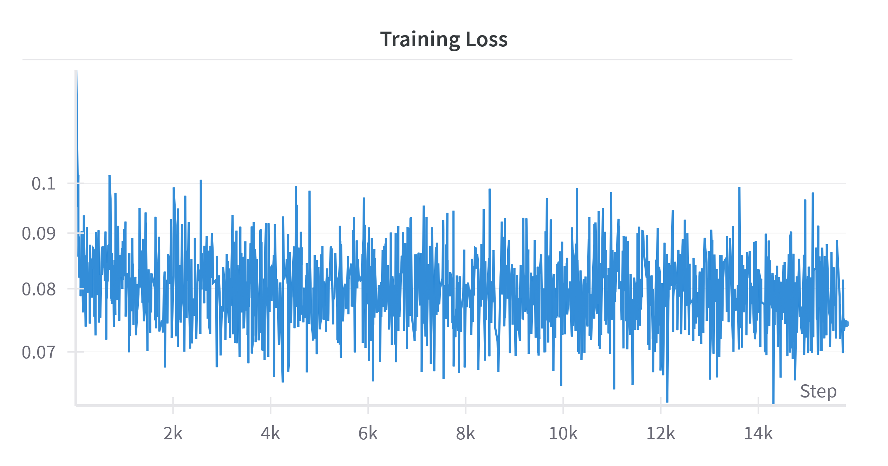

**Figure 3.3.8:** U-Net Attention Epoch 4 Training Loss
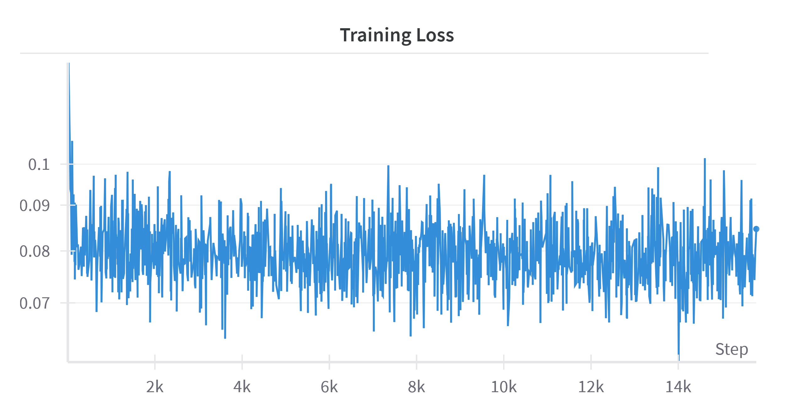

**Figure 3.3.9:** U-Net Attention Epoch 1 Validation Loss
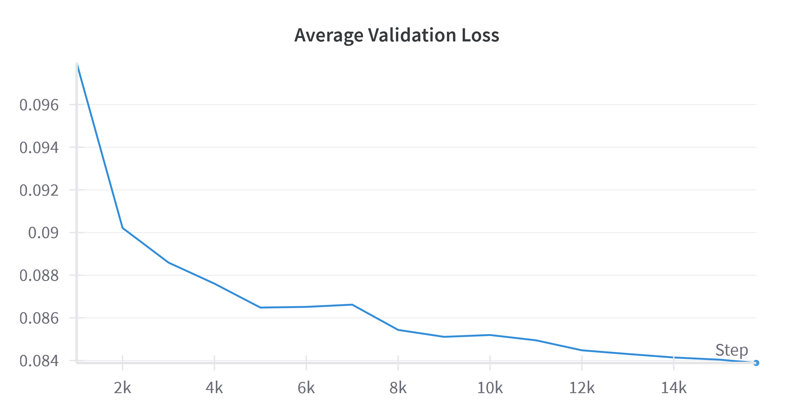

**Figure 3.3.10:** U-Net Attention Epoch 2 Validation Loss
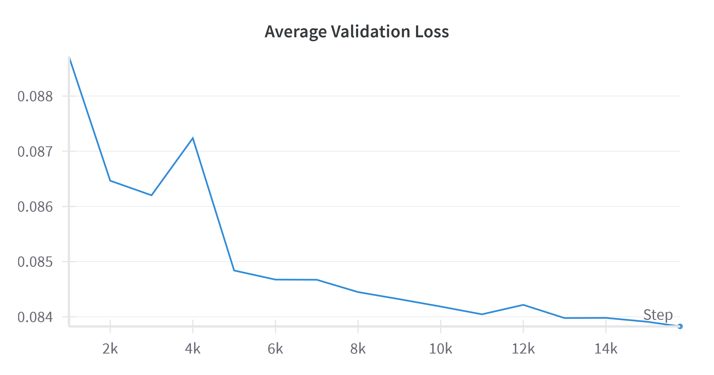

**Figure 3.3.11:** U-Net Attention Epoch 3 Validation Loss
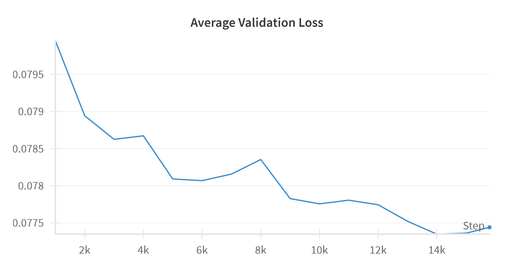

**Figure 3.3.12:** U-Net Attention Epoch 4 Validation Loss
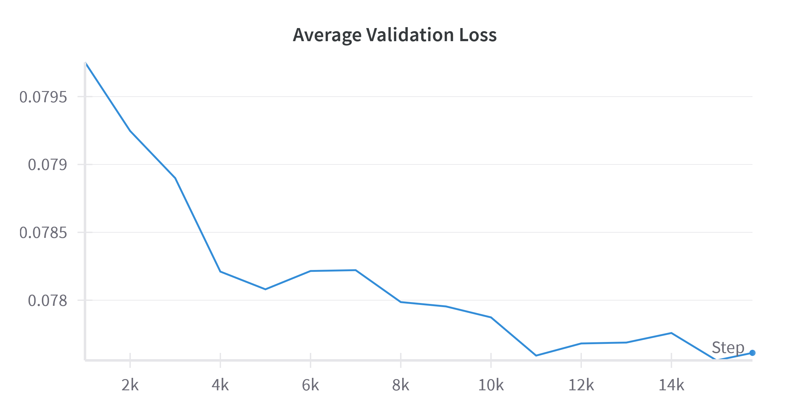


### Model 4: U-Net GAN with Criss-Cross Attention
**Figure 3.4.1:** U-Net GAN Attention Validation Set Results


**Legend:**\
**Top image:** grayscale input\
**Middle image:** model output\
**Bottom image:** expected output

### Model 4.5: U-Net GAN with Criss-Cross Attention
**Figure 3.5.1:** U-Net Gan Attention Validation Set Results


**Legend:**\
**Top image:** grayscale input\
**Middle image:** model output\
**Bottom image:** expected output

**Figure 3.5.2:** U-Net Gan Attention Generator Loss
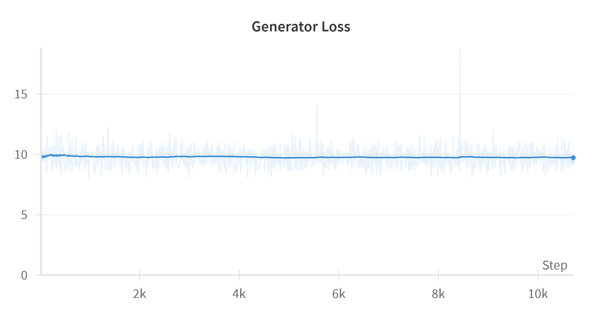

**Figure 3.5.3:** U-Net Gan Attention Discriminator Loss
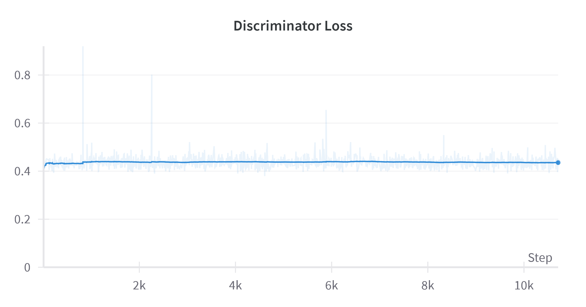


## Discussion
### Data Exploration

### Preprocessing

### Model 1: Convolutional Neural Network

### Model 2: U-Net

### Model 3: U-Net with Criss-Cross Attention

### Model 4: U-Net GAN with Criss-Cross Attention

### Model 4.5: U-Net GAN with Criss-Cross Attention

## Conclusion
## Statement of Collaboration
| Name   | Title | Contribution                                                                              |
|--------|-------|-------------------------------------------------------------------------------------------|
| Justin |       | Weekly coding meetings, write up for milestone 1                                          |
| Rona   |       | Weekly coding meetings,                                                                   |
| Diego  |       | Weekly coding meetings,                                                                   |
| Jose   |       | Weekly coding meetings, write up for milestone 2, intro and preprocessing for milestone 4 |
| Logan  |       | Weekly coding meetings, data exploration for larger data set, write up for milestone 4    |
| Daniel |       | Weekly coding meetings, handled most of the coding                                        |